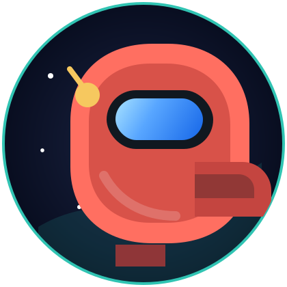

<p align="center">
  
</p>

<h1 align="center">Md Asif</h1>

<p align="center">
  <strong>Developer builder on a practical little space mission.</strong><br />
  I build clean web experiences, useful tools, and reliable systems that turn ideas into working products.
</p>

<p align="center">
  <a href="https://github.com/mdasifinit?tab=repositories">
    
  </a>
  <a href="https://github.com/mdasifinit">
    
  </a>
  
</p>

<p align="center">
  
</p>

## Current Mission



- Building full-stack web experiences with a focus on clarity, speed, and usability.
- Turning repeated work into small tools, scripts, and workflows.
- Learning in public through experiments, notes, and practical project iterations.
- Keeping the vibe playful, but the implementation dependable.

<br clear="right" />

## Tech Loadout

<p>
  
  
  
  
  
  
  
  
</p>

```txt
ship.log
status      : building useful things
orbit       : web apps, automation, developer tools
priority    : clean interfaces, steady iteration, practical outcomes
crew rule   : original space vibes only
```

## GitHub Signals

<p align="center">
  
  
</p>

## Featured Transmissions

| Transmission | Signal | Stack |
| --- | --- | --- |
| `portfolio-system` | Personal profile and portfolio experiments. | HTML, CSS, JS |
| `workflow-toolkit` | Small automations for repeated developer work. | Node.js, APIs |
| `engineering-notes` | Notes, prototypes, and learning logs. | Docs, systems, UX |

## Connect

<p>
  <a href="https://github.com/mdasifinit">
    
  </a>
  <a href="https://github.com/mdasifinit/mdasifinit/issues">
    
  </a>
</p>

<p align="center">
  <sub>Profile README for <code>mdasifinit/mdasifinit</code>. Built like a calm mission control panel with a tiny space-crew wink.</sub>
</p>
