<p align="center">
  
</p>

<h1 align="center">Md Asif</h1>
<h2 align="center">AI Automation Engineer</h2>

<p align="center">
  <strong>I automate workflows and build fast, scalable applications for businesses.</strong><br />
  Passionate about clean code, AI tools, and creating delightful user experiences.
</p>

<p align="center">
  <a href="https://mdasifinit.github.io/portfolio/">
    
  </a>
  <a href="https://github.com/MdAsifInIT?tab=repositories">
    
  </a>
  <a href="https://github.com/MdAsifInIT/MdAsifInIT/issues">
    
  </a>
</p>

<p align="center">
  
</p>

## 你好 / こんにちは / Hi there

- Building AI-assisted workflow automation for real business problems.
- Creating fast, responsive applications with clean interfaces.
- Working across Python, PowerShell, C#, TypeScript, React, cloud, and developer tooling.
- Keeping this profile in orbit with animated space visuals and repo-backed sections.

## Github State & Skills

<p align="center">
  <strong>Github State</strong>
  &nbsp;&nbsp;&nbsp;&nbsp;
  <strong>Skills</strong>
  &nbsp;&nbsp;&nbsp;&nbsp;
  <strong>Top Language</strong>
</p>

<p align="center">
  
  
  
</p>

## Pinned

<p align="center">
  <a href="https://github.com/MdAsifInIT/NotionLM">
    
  </a>
  <a href="https://github.com/MdAsifInIT/sanity-gravity">
    
  </a>
</p>

<p align="center">
  <a href="https://github.com/MdAsifInIT/EZ-PS-Automations">
    
  </a>
  <a href="https://github.com/MdAsifInIT/pokeswitch">
    
  </a>
</p>

## Repositories In Orbit

| Repository | Signal | Stack |
| --- | --- | --- |
| [NotionLM](https://github.com/MdAsifInIT/NotionLM) | Notion to Google Docs pipeline with sync state, retry handling, and document upsert logic. | Python |
| [sanity-gravity](https://github.com/MdAsifInIT/sanity-gravity) | Sandbox guardrails for AI coding agents and developer sanity. | Python |
| [EZ-PS-Automations](https://github.com/MdAsifInIT/EZ-PS-Automations) | PowerShell automation utilities for repeatable Windows/developer workflows. | PowerShell |
| [pokeswitch](https://github.com/MdAsifInIT/pokeswitch) | C# project currently active in the public repo list. | C# |
| [bglr-premium-listings](https://github.com/MdAsifInIT/bglr-premium-listings) | TypeScript project in progress. | TypeScript |
| [NotebookLMWrapper](https://github.com/MdAsifInIT/NotebookLMWrapper) | Desktop wrapper experiment for a focused NotebookLM experience. | C# |

## About Me

```txt
location    : Bengaluru, IN
role        : AI Automation Engineer
orbit       : AI automation, sync pipelines, enterprise scripts, developer tools
focus       : clean code, scalable workflows, practical outcomes
education   : BSc Design & Computing, BITS Pilani
```

## Certifications

- Microsoft Certified: Azure Fundamentals
- Microsoft Certified: Azure AI Fundamentals
- Microsoft Certified: Azure AI Engineer Associate

## Get In Touch

<p>
  <a href="https://github.com/MdAsifInIT">
    
  </a>
  <a href="https://linkedin.com/in/mdasifinit">
    
  </a>
  <a href="https://github.com/MdAsifInIT/MdAsifInIT/issues">
    
  </a>
</p>

<p align="center">
  <sub>Profile README for <code>MdAsifInIT/MdAsifInIT</code>. Animated space vibe, repo-backed pins, no borrowed game assets.</sub>
</p>
