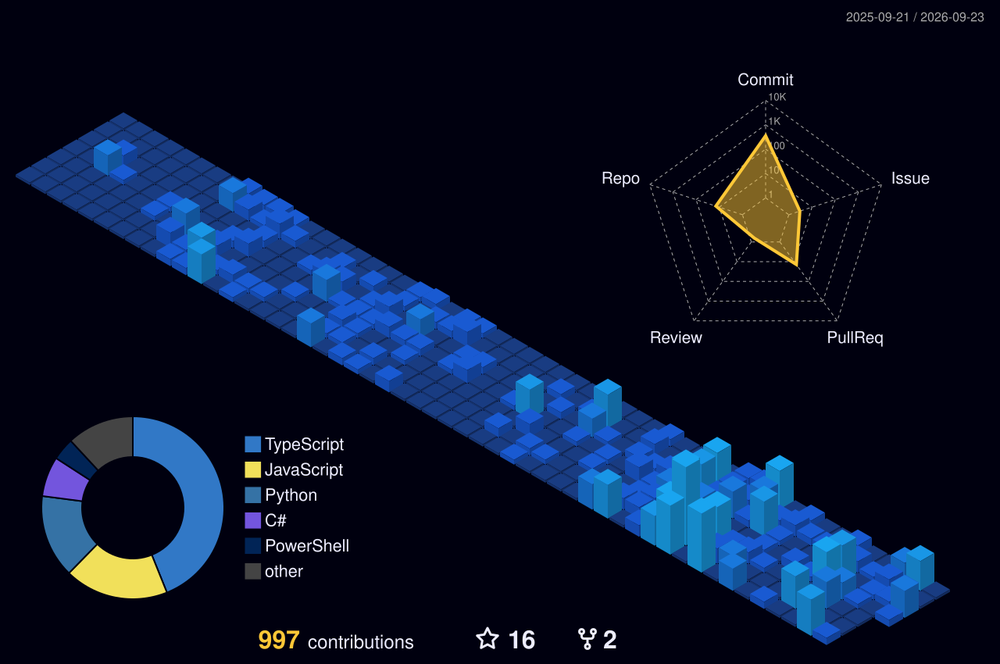

  <picture>
    <source media="(max-width: 600px)" srcset="assets/banner-mobile.svg" />
    
  </picture>

  <a href="https://mdasifinit.github.io/portfolio/"><strong>Portfolio</strong></a>
  &nbsp;·&nbsp;
  <a href="https://linkedin.com/in/mdasifinit"><strong>LinkedIn</strong></a>
  &nbsp;·&nbsp;
  <a href="https://github.com/MdAsifInIT?tab=repositories"><strong>Repositories</strong></a>
  &nbsp;·&nbsp;
  <a href="https://github.com/MdAsifInIT/MdAsifInIT/issues/new"><strong>Contact</strong></a>

## What I build

Systems that stay out of the way: practical, resilient, and ready to be handed off.

<table>
  <tr>
    <td width="50%">
      <strong>AI workflow automation</strong> 
      Pipelines that remove repetitive work from developer and business operations.
    </td>
    <td width="50%">
      <strong>Integration systems</strong> 
      Document pipelines, retry logic, upsert flows, and cross-tool state management.
    </td>
  </tr>
  <tr>
    <td>
      <strong>Enterprise scripting</strong> 
      PowerShell, Python, and C# utilities built for production environments.
    </td>
    <td>
      <strong>Developer tools</strong> 
      TypeScript and React interfaces with clear hierarchy and minimal friction.
    </td>
  </tr>
</table>

## Selected systems

| System | Stack | Engineering focus |
|---|---|---|
| [Open Project Manager](https://github.com/MdAsifInIT/open-project-manager) | `TypeScript` `Next.js` | Open-source project management with a modern product surface. |
| [Samruna](https://github.com/MdAsifInIT/Samruna) | `Python` `Docker` | High-performance, event-driven automation pipelines. |
| [NotionLM](https://github.com/MdAsifInIT/NotionLM) | `Python` | Resilient Notion-to-Google Docs sync with retry and upsert handling. |

## 3D contribution history

  

<strong>Private project deck</strong> — selected work in progress

| Project | Public summary |
|---|---|
| AICP | AI co-packaging and automation workspace. |
| AIML | AI and machine-learning experimentation lab. |
| Self Evolving Transpiler | Adaptive transpiler research and code transformation. |
| Work Graph Foundry | Product strategy and autonomous implementation workflows. |

## Profile

| | |
|---|---|
| **Role** | AI Developer |
| **Based in** | Bengaluru, India |
| **Education** | BSc Design & Computing — BITS Pilani |
| **Focus** | AI automation · integrations · developer tooling |
| **Credentials** | Azure Fundamentals · Azure AI Fundamentals · Azure AI Engineer Associate |

  Build systems that are clear to operate, easy to transfer, and difficult to break.

